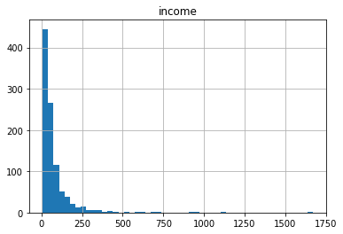
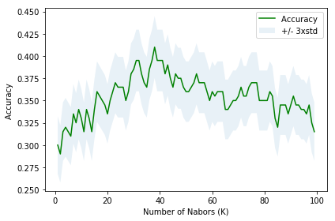

```python
import numpy as np
import matplotlib.pyplot as plt
import pandas as pd
from sklearn import preprocessing
```


```python
df=pd.read_csv('https://s3-api.us-geo.objectstorage.softlayer.net/cf-courses-data/CognitiveClass/ML0101ENv3/labs/teleCust1000t.csv')
print(list(df)) #df.columns
print(df.head(2))
print('shape',np.shape(df))
print(df['custcat'].value_counts()) ##know how many datas that falls into each group
df.hist(column='income', bins=50)
plt.show()
```

    ['region', 'tenure', 'age', 'marital', 'address', 'income', 'ed', 'employ', 'retire', 'gender', 'reside', 'custcat']
       region  tenure  age  marital  address  income  ed  employ  retire  gender  \
    0       2      13   44        1        9    64.0   4       5     0.0       0   
    1       3      11   33        1        7   136.0   5       5     0.0       0   
    
       reside  custcat  
    0       2        1  
    1       6        4  
    shape (1000, 12)
    3    281
    1    266
    4    236
    2    217
    Name: custcat, dtype: int64





```python
##change to array
x = df[['region', 'tenure','age', 'marital', 'address', 'income', 'ed', 'employ','retire', 'gender', 'reside']] .values  #.astype(float)
y = df['custcat'].values
```


```python
# Data Standardization give data zero mean and unit variance, it is good practice, especially for algorithms such as KNN which is based on distance of cases
x = preprocessing.StandardScaler().fit(x).transform(x.astype(float))
```


```python
##split
from sklearn.model_selection import train_test_split
x_train, x_test, y_train, y_test = train_test_split( x, y, test_size=0.2, random_state=4)
print ('Train set:', x_train.shape,  y_train.shape)
print ('Test set:', x_test.shape,  y_test.shape)
```

    Train set: (800, 11) (800,)
    Test set: (200, 11) (200,)


```python
##KNN
from sklearn.neighbors import KNeighborsClassifier
k = 4
##train model 
neigh = KNeighborsClassifier(n_neighbors = k).fit(x_train,y_train)
print(neigh)
##predict
yhat = neigh.predict(x_test)
```

    KNeighborsClassifier(algorithm='auto', leaf_size=30, metric='minkowski',
               metric_params=None, n_jobs=None, n_neighbors=4, p=2,
               weights='uniform')


```python
##evaluation
from sklearn import metrics
print("Train set Accuracy: ", metrics.accuracy_score(y_train, neigh.predict(x_train)))
print("Test set Accuracy: ", metrics.accuracy_score(y_test, yhat))
```

    Train set Accuracy:  0.5475
    Test set Accuracy:  0.32


```python
##K
Ks = 100
mean_acc = np.zeros((Ks-1))
std_acc = np.zeros((Ks-1))
for n in range(1,Ks):
    
    #Train Model and Predict  
    neigh = KNeighborsClassifier(n_neighbors = n).fit(x_train,y_train)
    yhat=neigh.predict(x_test)
    mean_acc[n-1] = metrics.accuracy_score(y_test, yhat)
    std_acc[n-1]=np.std(yhat==y_test)/np.sqrt(yhat.shape[0])
##plot accuracy
plt.plot(range(1,Ks),mean_acc,'g')
plt.fill_between(range(1,Ks),mean_acc - 1 * std_acc,mean_acc + 1 * std_acc, alpha=0.10)
plt.legend(('Accuracy ', '+/- 3xstd'))
plt.ylabel('Accuracy ')
plt.xlabel('Number of Nabors (K)')
plt.tight_layout()
plt.show()
```





```python
print( "The best accuracy was with", mean_acc.max(), "with k=", mean_acc.argmax()+1) 
```

    The best accuracy was with 0.41 with k= 38

